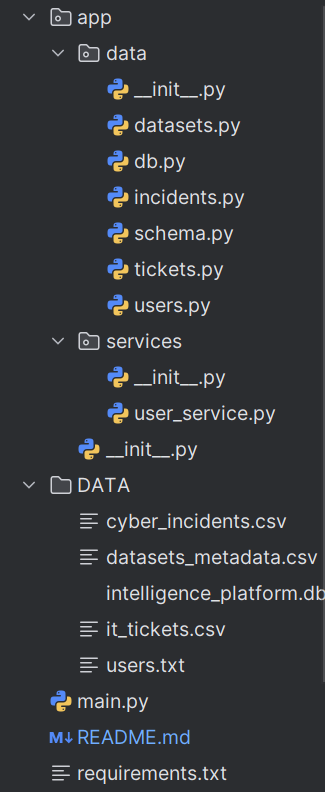
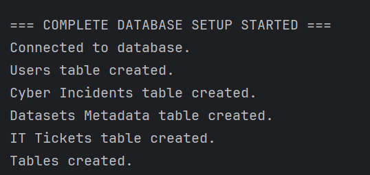
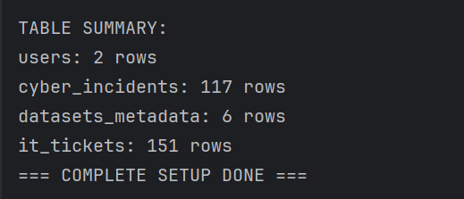
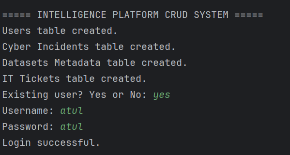
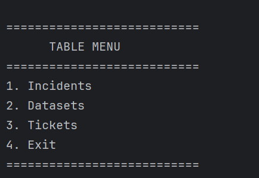
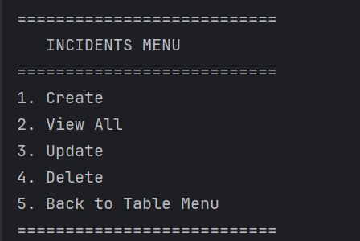
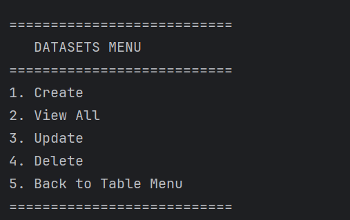
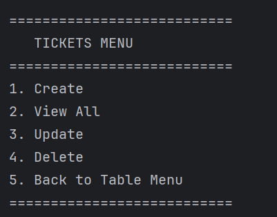

# Intelligence Platform — Week 8 Database Layer & Data Intelligence Engine
**Student Name:** ATUL SURESH NAIR 
**Student ID:** M01089590 
**Course:** CST1510 - CW2 - Multi-Domain Intelligence Platform  

##  Project Overview

The **Intelligence Platform** is a multi-domain data processing system that supports:

* **Cybersecurity incidents management**
* **Dataset metadata cataloging**
* **IT ticket processing**
* **User authentication & role assignment**

This project upgrades the Week 7 text‑file system into a full **database‑driven intelligence engine** with:

* A unified **SQLite relational database**
* Automated **data ingestion** from CSV datasets
* **CRUD operations** across all three intelligence domains
* **Secure authentication** using bcrypt hashing
---

##  Purpose of the Project

Modern intelligence platforms need to process diverse data sources reliably. This Week 8 project demonstrates:

### Handling multiple data domains

The platform brings together three real-world operational areas:

1. **Cyber Incidents** — Managing threats, severity, and status tracking
2. **Datasets Metadata** — Cataloging datasets used by analysts
3. **IT Tickets** — Tracking technical issues within an organization

---

##  Authentication & Security Features

Security is a core part of real intelligence systems. The project includes:

* **Password hashing (bcrypt)** — prevents plaintext password storage
* **Parameterized SQL queries** — protects against SQL injection
* **User roles** (e.g., user, analyst)
* **Migration** of Week 7 accounts into the database

The system demonstrates how real applications manage user identities safely.

---

## What the Database Enables

By designing robust tables for incidents, datasets, tickets, and users, the system allows:

###  Fast searching and filtering

Analysts can query:

* All open incidents
* High-severity cases
* Dataset categories
* Tickets assigned to a technician

###  Data-driven insights

With SQL and Pandas, users can compute:

* Incidents per type
* High-severity trends
* Tickets per category
* Large dataset statistics

###  Reliable CRUD operations

All objects in the platform support:

* **Create** new records
* **Read** existing data
* **Update** fields such as incident status
* **Delete** entries when needed

---

##  End-to-End Workflow Summary

When you run `main.py`, the system performs the complete backend workflow:

1. **Create database** (if missing)
2. **Generate required tables** for all domains
3. **Migrate Week 7 users** into the new unified system
4. **Load CSV files** into the database
5. **Register & authenticate test users**
6. **Create and retrieve incidents** to validate CRUD logic
7. **Produce analytical summaries** (optional)

This mirrors how real data platforms initialize and validate backend reliability.

---

## Data Ingestion & Intelligence Pipelines

The platform ingests three CSV datasets:

* `cyber_incidents.csv`
* `datasets_metadata.csv`
* `it_tickets.csv`

These represent structured intelligence sources. The ingestion process:

* Reads each CSV through **Pandas**
* Validates structure
* Inserts records into corresponding tables
* Reports how many rows were loaded

This demonstrates how real intelligence pipelines bootstrap their databases.

---

##  Testing Philosophy

The system includes a full **comprehensive testing suite** (Part 10) which confirms:

* User registration & login work correctly
* Bcrypt hashing validates passwords
* CSV ingestion is successful
* CRUD operations behave as expected
* Records can be retrieved and verified

These tests simulate how organizations validate their data backend before deploying an intelligence platform.

---

##  Practical Skills Demonstrated

This Week 8 project teaches core industry skills:

### Database schema design

###  Secure authentication

### Multi-table CRUD operations

### CSV ingestion pipelines

### Modular application architecture

### Debugging SQL and schema issues

You now have a scalable foundation suitable for:

* Web applications
* Dashboards
* Data analytics tools
* Security monitoring systems

---

###  1. Project Folder Structure

---

###  2. Database Creation Success

---

###  3. User Migration Output

---

###  4. Table Menu

---

###  5.Table specific Menu

---

---

---

